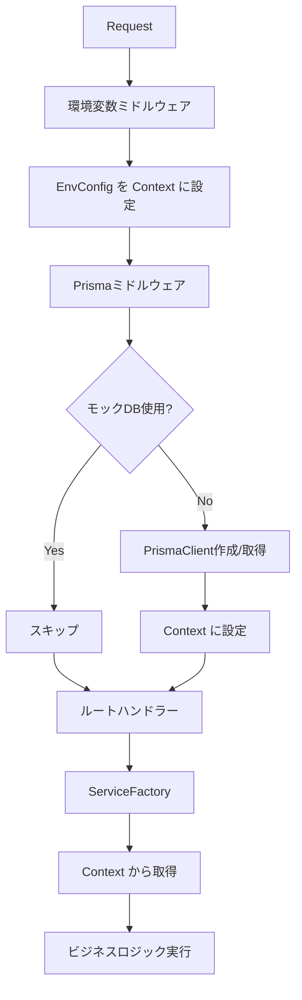

# PrismaClient 一元管理リファクタリング

## 概要

PrismaClient の管理をミドルウェアで一元化し、アプリケーション全体でより効率的な接続管理を実現しました。

## 変更内容

### 1. 新しい型定義の追加（`src/types/app-context.ts`）

```typescript
export type AppVariables = {
  envConfig: EnvConfig;
  prisma?: PrismaClient;  // モックDB使用時は undefined
};

export type AppContext = {
  Bindings: Bindings;
  Variables: AppVariables;
};
```

### 2. ミドルウェアの順序と責務

```
1. 環境変数ミドルウェア → envConfig を Context に設定
2. Prismaミドルウェア → envConfig から PrismaClient を作成し Context に設定
3. ルートハンドラー → Context から両方を取得して使用
```

### 3. アーキテクチャの改善点

#### Before（リファクタリング前）
- `AdminInvitationServiceFactory` が独自に PrismaClient を作成
- 接続管理が分散
- 同じ PrismaClient のインスタンスが複数作成される可能性

#### After（リファクタリング後）
- PrismaClient はミドルウェアで一元管理
- `AdminInvitationServiceFactory` は Context から取得
- 接続の再利用が保証される

## 利点

### 1. **接続管理の一元化**
- PrismaClient の作成と管理が一箇所に集約
- デバッグとメンテナンスが容易

### 2. **パフォーマンスの向上**
- PrismaClient インスタンスの重複作成を防止
- コンテナ再利用時の接続効率が向上

### 3. **型安全性の向上**
- `AppContext` 型により、Context の内容が明確
- TypeScript の型チェックが効果的に機能

### 4. **テスタビリティの向上**
- モックの注入が容易
- 単体テストの作成が簡単

## 実装の流れ



## 使用例

### ルートハンドラーでの使用

```typescript
app.get('/api/users', async (c) => {
  const envConfig = c.var.envConfig;  // 環境設定
  const prisma = c.var.prisma;        // PrismaClient
  
  // ビジネスロジック...
});
```

### サービスファクトリーでの使用

```typescript
export class ServiceFactory {
  static createService(c: Context<AppContext>) {
    const envConfig = c.var.envConfig;
    const prisma = c.var.prisma;
    
    const repository = RepositoryFactory.create(
      envConfig.config.database.useMockDb,
      prisma  // ミドルウェアで管理された PrismaClient
    );
    
    // サービスの構築...
  }
}
```

## 注意事項

### 1. ミドルウェアの適用順序
- `envConfig` ミドルウェアは必ず `prisma` ミドルウェアより前に適用
- API ルートにのみ `prisma` ミドルウェアを適用（ヘルスチェックなどには不要）

### 2. エラーハンドリング
- `envConfig` が設定されていない場合のエラーチェック
- `DATABASE_URL` が設定されていない場合のエラーチェック

### 3. モックDB使用時
- `c.var.prisma` は `undefined` になる可能性がある
- リポジトリファクトリーで適切に処理される

## マイグレーションガイド

既存のコードをこの新しいアーキテクチャに移行する場合：

1. **型定義の更新**
   ```typescript
   // Before
   new Hono<{ Bindings: Bindings }>()
   
   // After
   new Hono<AppContext>()
   ```

2. **Context からの取得**
   ```typescript
   // Before
   const envConfig = new EnvConfig(c.env);
   
   // After
   const envConfig = c.var.envConfig;
   ```

3. **PrismaClient の取得**
   ```typescript
   // Before
   const prisma = PrismaClientFactory.getClient(databaseUrl);
   
   // After
   const prisma = c.var.prisma;
   ```

## パフォーマンス考慮事項

- PrismaClient のキャッシュにより、warm コンテナでの接続再利用
- `$disconnect()` を呼ばないことで、接続オーバーヘッドを削減
- Supabase pgbouncer との組み合わせで最適なパフォーマンス

## まとめ

このリファクタリングにより、PrismaClient の管理がより効率的かつ保守しやすくなりました。
アーキテクチャが明確になり、将来の拡張や変更も容易になっています。