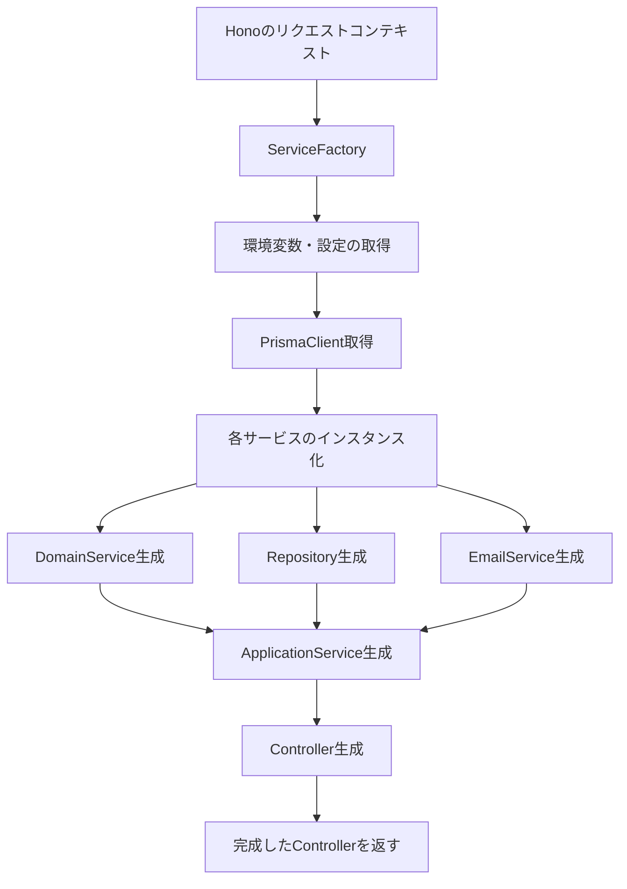

# 依存性注入（DI）コンテナとしてのServiceFactory

## 📌 このディレクトリの役割

`/adapter/config`ディレクトリは、アプリケーション全体の**依存性注入（Dependency Injection）設定**を管理する場所です。ここに配置されたファクトリークラスは、DIコンテナとして機能します。

## 🤔 DIコンテナとは？

DIコンテナは、オブジェクトの生成と依存関係の解決を一元的に管理するコンポーネントです。

### 一般的なDIコンテナの例（Spring、NestJS等）
```typescript
// 一般的なDIコンテナでは、アノテーションで依存関係を宣言
@Injectable()
class UserService {
  constructor(
    @Inject() private repository: UserRepository,
    @Inject() private emailService: EmailService
  ) {}
}
```

### 当プロジェクトでのDIコンテナ
```typescript
// 手動でDIコンテナとして機能するファクトリーを実装
export class AdminInvitationServiceFactory {
  static createPerRequestController(c: Context): AdminInvitationsController {
    // 依存関係を手動で組み立てる
    const repository = new PrismaRepository(prisma);
    const emailService = new EmailService(config);
    const domainService = new DomainService();
    const applicationService = new ApplicationService(repository, emailService, domainService);
    const controller = new Controller(applicationService);
    
    return controller;
  }
}
```

## 🎯 なぜDIコンテナが必要なのか？

### 1. **依存関係の複雑さを隠蔽**

```typescript
// ❌ DIコンテナなしの場合（handlers/admin-invitations.handlers.ts内で直接構築）
export const create = async (c: Context) => {
  // ハンドラー内で複雑な依存関係を構築しなければならない
  const envConfig = c.var.envConfig;
  const prisma = c.var.prisma;
  const domainService = new AdminInvitationDomainService();
  const emailService = EmailServiceFactory.createEmailService(envConfig);
  const repository = AdminInvitationRepositoryFactory.create(
    config.database.useMock,
    prisma
  );
  const createAdminInvitationUseCase = new CreateAdminInvitationApplicationService(
    domainService,
    repository,
    repository,
    emailService
  );
  const controller = new AdminInvitationsController(
    createAdminInvitationUseCase,
    envConfig
  );
  
  return controller.create(c);
};
```

```typescript
// ✅ DIコンテナありの場合（現在の実装）
export const create = async (c: Context) => {
  // シンプルに1行で済む
  const controller = AdminInvitationServiceFactory.createPerRequestController(c);
  return controller.create(c);
};
```

### 2. **Clean Architectureの層の分離を維持**

```
┌─────────────────────────────────────────┐
│           Webハンドラー層                │
│  （依存関係の詳細を知らなくてよい）        │
└─────────────────────────────────────────┘
                    ↓
┌─────────────────────────────────────────┐
│         DIコンテナ（Factory）            │
│    （全ての依存関係を知っている）          │
└─────────────────────────────────────────┘
                    ↓
┌──────────┬──────────┬──────────────────┐
│Controller│UseCase   │Repository        │
│          │          │EmailService      │
│          │          │DomainService     │
└──────────┴──────────┴──────────────────┘
```

### 3. **テスタビリティの向上**

```typescript
// テスト時は別のファクトリーメソッドを用意できる
export class AdminInvitationServiceFactory {
  // 本番用
  static createPerRequestController(c: Context): AdminInvitationsController {
    // 実際のサービスを使用
  }
  
  // テスト用
  static createForTesting(
    mockRepository?: Repository,
    mockEmailService?: EmailService
  ): AdminInvitationsController {
    // モックを注入できる
  }
}
```

## 🔧 AdminInvitationServiceFactoryの動作フロー



## 📊 DIコンテナとしての責務

| 責務 | 説明 | 例 |
|------|------|-----|
| **オブジェクトの生成** | 必要なインスタンスを適切な順序で生成 | `new AdminInvitationDomainService()` |
| **依存関係の解決** | 各クラスが必要とする依存を注入 | `new ApplicationService(domain, repo, email)` |
| **設定の管理** | 環境変数や設定値を適切に配布 | `c.var.envConfig`から設定を取得 |
| **ライフサイクル管理** | リクエスト毎の新規インスタンス生成 | `createPerRequestController`で毎回新規作成 |
| **モック切り替え** | 開発/テスト環境でのモック利用 | `config.database.useMock`で切り替え |

## 💡 メリット

1. **単一責任の原則（SRP）**: 各クラスは自身の責務に集中できる
2. **依存性逆転の原則（DIP）**: 上位レイヤーが下位レイヤーの実装詳細に依存しない
3. **開放閉鎖の原則（OCP）**: 新しいサービスの追加が容易
4. **テストの容易性**: モックの注入が簡単
5. **設定の一元管理**: 依存関係の構築ロジックが1箇所に集約

## 🚀 今後の拡張例

```typescript
// 将来的に複数のファクトリーを管理する場合
/adapter/config/
  ├── README.md                           # このファイル
  ├── admin-invitation-service-factory.ts # 管理者招待用
  ├── user-service-factory.ts            # ユーザー管理用
  ├── payment-service-factory.ts         # 決済処理用
  └── di-container.ts                    # 統合DIコンテナ

// di-container.ts の例
export class DIContainer {
  private static factories = new Map();
  
  static register(name: string, factory: Function) {
    this.factories.set(name, factory);
  }
  
  static resolve<T>(name: string, context: Context): T {
    const factory = this.factories.get(name);
    return factory(context);
  }
}
```

## 📝 まとめ

`AdminInvitationServiceFactory`は単なるファクトリーパターンの実装ではなく、**アプリケーション全体の依存関係を管理するDIコンテナ**として機能しています。これにより、Clean Architectureの原則を守りながら、保守性とテスタビリティの高いコードを実現しています。
